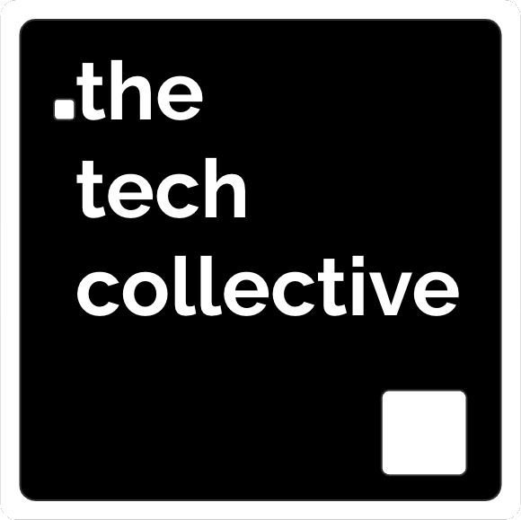

# Flow Tech

Hacking snippets that will automate your daily workflow

Note: Bid welcome, point to the restrooms, the coffee. When will there be food?

---

## .the tech collective

The tech artisans of Implement

Note: Show the tech-that.club site and the DevX group on meetup. Have the colleagues stand up

--

## Flow Tech
#### Definition

FlowTech (workflow technology) is the use of information technology (IT) to help individuals and companies optimize, automate, smooth and integrate workflow processes through means of
technology. 

--

## Flow Tech
#### ...Definition

Similar to the way FinTech and PropTech focuses on the use of technology in
finance and Property industries respectively, FlowTech uses digital innovation to address the needs of optimize and digitize workflows.

--

## Flow Tech
#### ...Definition

FlowTech is designed to streamline and connect processes for participants in all stages of a digital work process or product life-cycle, including developers, designers, leaders, content writers, QA workers, testers, regulatory bodies, security workers, operations, support workers and end-users. 

--

## Flow Tech
#### ...Definition

Popular FlowTech technologies include declarative pipelines, workflow automation platforms, containers, serverless no-code and low-code platforms, generative AI, ChatBots, dashboards, machine learning, APIs, CLIs and a wide use of extensions and plug-ins to existing tech.

--

## Flow Tech
#### ...Definition

FlowTech consists of four major segments of utilization:

- Developer Experience (DX)
- Workflow automation
- Infrastructure as Code
- Citizen Development

---

## The Plan for today

### Brainstorm!

Where du you wanna go?

---

## Backup 

### Entertainment

 - Reveal.js
 - Logic App
 - GitHub CLI extension
 - GitHub Action
 - Generative AI
 - Paired (mob) programming

---

## Sandwich

### and drinks

@ 1800

